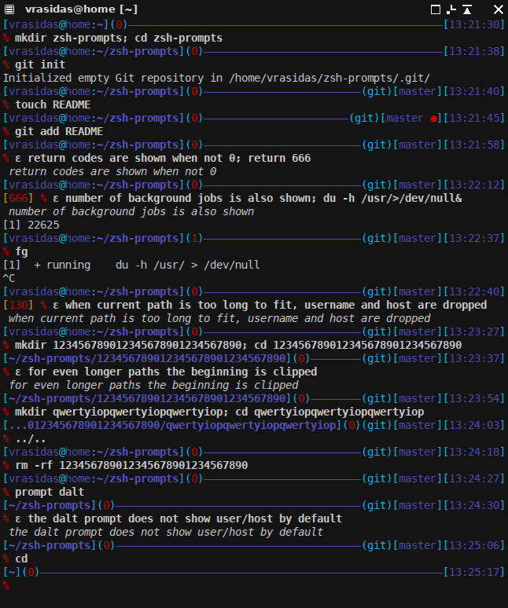

###Two zsh prompts that I created.

They started out as a mod of the adam2 prompt that comes with zsh

Put the files in a directory in zsh's fpath and load promptinit.

For example in your .zshrc:
_______________________________________________________
`#create this directory and place the files in it.`

`fpath=($HOME/.zsh/prompts $fpath)`

`autoload -Uz promptinit`

`promptinit`

`prompt drhl`
_______________________________________________________

Here's how it looks:

